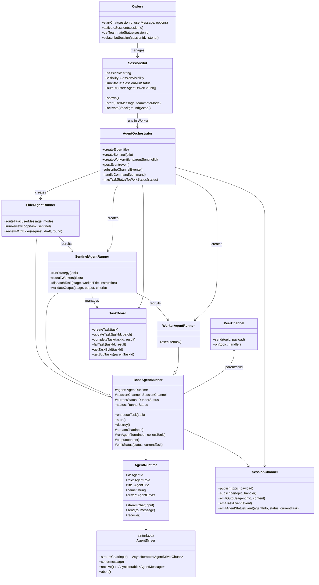
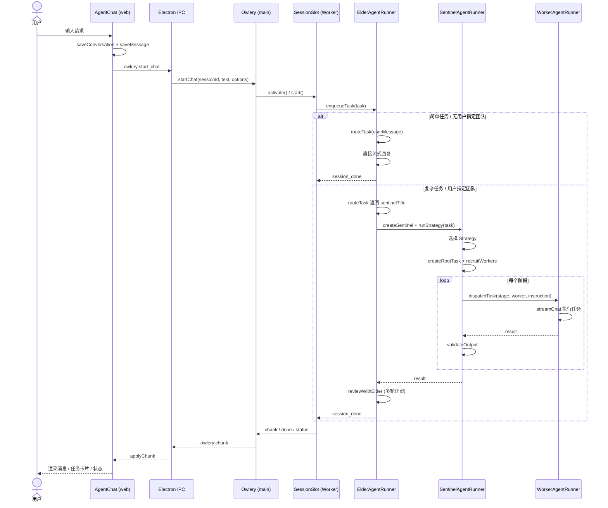
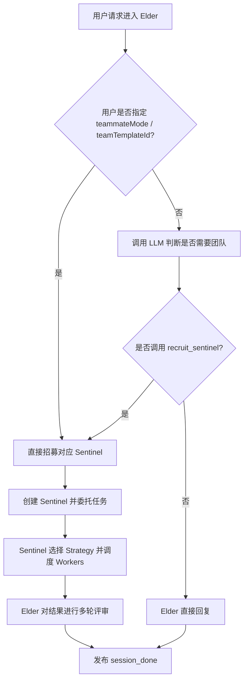
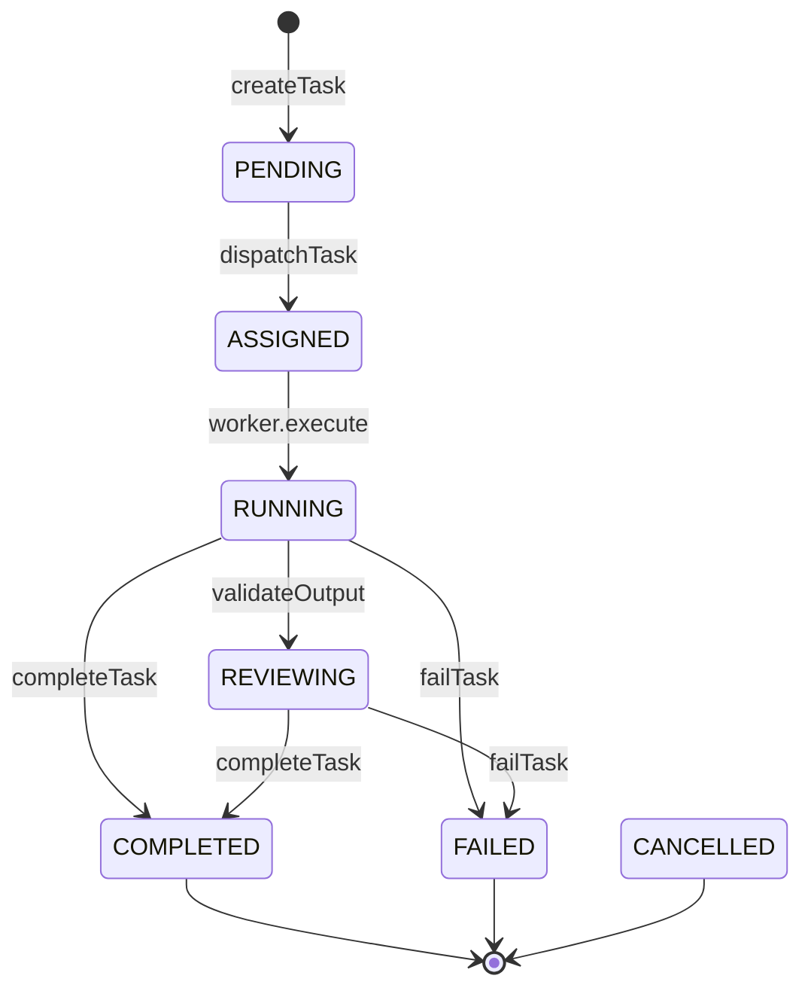

# OwlOS v1.0 架构说明

> 本文档描述 OwlOS 当前（2026-06-24）的技术架构、核心组件交互与数据流。
> 覆盖范围：前端 `apps/web`、桌面运行时 `apps/desktop`、共享包 `packages/*`。

---

## 1. 架构总览

OwlOS 是一个「意图驱动的 Agent 运行时系统」桌面应用。用户通过单一对话入口提交请求，系统由 **Elder Agent** 判断任务复杂度，决定直接自治回复或招募 **Sentinel + Worker** 团队协作完成。所有 Agent 运行在 Electron 主进程的 Worker 线程中，通过 `SessionChannel` / `PeerChannel` 通信；前端通过 Electron IPC 与 WebSocket 接收实时 chunk 与状态事件。

```text
┌─────────────────────────────────────────────────────────────────────────────┐
│                              前端层 apps/web                                 │
│  ┌──────────────┐  ┌──────────────┐  ┌──────────────┐  ┌──────────────┐   │
│  │   Chat UI    │  │  TaskBoard   │  │  Monitor /   │  │  Settings /  │   │
│  │  AgentChat   │  │  (任务看板)   │  │  ExecutionLog│  │  Knowledge   │   │
│  └──────┬───────┘  └──────┬───────┘  └──────┬───────┘  └──────┬───────┘   │
│         │                 │                 │                 │           │
│  ┌──────┴─────────────────┴─────────────────┴─────────────────┴───────┐   │
│  │                    services/electron.ts (IPC 封装)                   │   │
│  └─────────────────────────────────┬───────────────────────────────────┘   │
└────────────────────────────────────┼──────────────────────────────────────┘
                                     │ Electron IPC / WebSocket
┌────────────────────────────────────┼──────────────────────────────────────┐
│                          桌面层 apps/desktop                               │
│  ┌─────────────────────────────────┴───────────────────────────────────┐   │
│  │                    api/ipc/ + api/websocket/ (通信网关)               │   │
│  └─────────────────────────────────┬───────────────────────────────────┘   │
│                                     │                                       │
│  ┌──────────────────────────────────┴──────────────────────────────────┐  │
│  │                    agent-orchestrator/ (多 Agent 编排)                │  │
│  │  ┌─────────────┐  ┌─────────────┐  ┌─────────────┐  ┌────────────┐ │  │
│  │  │ ElderAgent  │  │SentinelAgent│  │ WorkerAgent │  │  Strategy  │ │  │
│  │  │   Runner    │  │   Runner    │  │   Runner    │  │ (Pipeline/ │ │  │
│  │  │             │  │             │  │             │  │ Brainstorm/│ │  │
│  │  │ 路由/评审    │  │  团队调度   │  │  任务执行   │  │ Supervisor/│ │  │
│  │  │             │  │             │  │             │  │ Hierarchy) │ │  │
│  │  └──────┬──────┘  └──────┬──────┘  └──────┬──────┘  └─────┬──────┘ │  │
│  │         │                │                │               │        │  │
│  │  ┌──────┴────────────────┴────────────────┴───────────────┴──────┐ │  │
│  │  │         SessionChannel (事件总线) + PeerChannel (父子通道)      │ │  │
│  │  │         TaskBoard (任务树) + MessageBox (跨 Agent 消息)         │ │  │
│  │  └───────────────────────────────────────────────────────────────┘ │  │
│  │                           AgentOrchestrator                         │  │
│  └─────────────────────────────────────────────────────────────────────┘  │
│                                     │                                       │
│  ┌──────────────────────────────────┴──────────────────────────────────┐  │
│  │                      agent-runtime/ (单 Agent 运行时)                 │  │
│  │  AgentFactory + PiAgentDriver/VercelAiDriver + ProviderConfig + Tools │  │
│  └─────────────────────────────────────────────────────────────────────┘  │
│                                     │                                       │
│  ┌──────────────────────────────────┴──────────────────────────────────┐  │
│  │                         db/ (SQLite 持久化)                           │  │
│  │  users / conversations / messages / agents / teams / knowledge / ...  │  │
│  └─────────────────────────────────────────────────────────────────────┘  │
└─────────────────────────────────────────────────────────────────────────────┘
                                     │
┌────────────────────────────────────┴──────────────────────────────────────┐
│                        共享包 packages/*                                   │
│  @owl-os/core : Agent 运行时抽象、类型、MessageBox、Session 类型           │
│  @owl-os/chat : 聊天相关共享逻辑（预留）                                    │
│  @owl-os/knowledge : 知识库共享逻辑（预留）                                 │
│  @owl-os/tools     : 工具市场共享逻辑（预留）                               │
│  @owl-os/workflow  : 工作流画布组件与 WorkflowStore（预留）                 │
└─────────────────────────────────────────────────────────────────────────────┘
```

---

## 2. 分层架构

| 层级 | 职责 | 关键目录/文件 |
|------|------|--------------|
| **表现层** | React UI、组件、状态管理、i18n | `apps/web/src/components/`、`contexts/`、`lib/i18n.ts` |
| **服务层（前端）** | 封装 Electron IPC / WebSocket 调用 | `apps/web/src/services/electron.ts`、`services/websocket.ts` |
| **通信层** | Electron preload、IPC handlers、WebSocket server | `apps/desktop/src/preload.ts`、`api/ipc/`、`api/websocket/` |
| **编排层** | 多 Agent 会话生命周期、任务调度、事件转发 | `apps/desktop/src/agent-orchestrator/` |
| **运行时层** | 单 Agent LLM 调用、工具执行、文件写入 | `apps/desktop/src/agent-runtime/` |
| **持久化层** | SQLite schema、查询、迁移、种子数据 | `apps/desktop/src/db/` |
| **共享抽象** | 类型定义与跨进程通用组件 | `packages/core/src/` |

---

## 3. 核心类图



---

## 4. 会话流程图

### 4.1 用户请求进入系统



### 4.2 Elder 路由决策



---

## 5. 任务生命周期与 TaskBoard

TaskBoard 维护一棵任务树，表达多 Agent 协作中的根任务与子任务关系。



任务事件流：

```text
SentinelAgentRunner
  -> taskBoard.createTask(rootTask)
  -> sessionChannel.emitTaskEvent(task_created)
  -> strategy.dispatchTask(rootTask)
     -> taskBoard.createTask(workerTask)
     -> sessionChannel.emitTaskEvent(task_assigned)
     -> worker.execute(task)
     -> taskBoard.completeTask(workerTask, result)
     -> sessionChannel.emitTaskEvent(task_completed)
  -> taskBoard.completeTask(rootTask, result)
  -> sessionChannel.emitTaskEvent(task_completed)

AgentOrchestrator
  -> sessionChannel.subscribe("task_event")
  -> map to task_card chunk with title/description/status/progress/assignee
  -> postEvent to RuntimePort / WebSocket
```

---

## 6. 状态流

### 6.1 Agent 状态

每个 `BaseAgentRunner` 通过 `emitStatus(status: AgentWorkStatus, currentTask?: string)` 报告状态。状态枚举：

```ts
enum AgentWorkStatus {
  NOT_STARTED = "not_started",
  WAITING     = "waiting",
  IN_PROGRESS = "in_progress",
  COMPLETED   = "completed",
  FAILED      = "failed",
  CANCELLED   = "cancelled",
}
```

### 6.2 状态流转到前端

```text
BaseAgentRunner.emitStatus
  -> SessionChannel.emitAgentStatusEvent
  -> AgentOrchestrator.subscribeChannelEvents
     -> status_card chunk (text + status + agentInfo)
     -> TeammateStatus (leader + members)
  -> RuntimePort.postEvent
  -> Owlery.subscribeSession / WebSocket / IPC
  -> 前端 useOwleryRuntime.applyChunk
     -> setAgentOutputs
  -> ChatHeader Bot Popover 展示团队状态
```

---

## 7. 数据持久化

数据库文件：`~/.config/owl-os/db/owl_os.db`（WAL 模式）。

核心表：

| 表 | 说明 |
|---|---|
| `users` | 本地用户与密码哈希 |
| `conversations` | 会话元数据（mode、teamTemplateId、agentNames） |
| `messages` | 用户/Agent 消息持久化 |
| `agents` | Agent 配置（角色、模型、系统提示等） |
| `teams` | 团队模板 |
| `knowledge_docs` / `doc_chunks` | 知识库文档与切片 |
| `workflow_templates` | 工作流模板 |
| `session_logs` / `audit_logs` | 会话日志与审计日志 |

前后端时间约定：后端以 `number`（ms 时间戳）存储；`apps/web/src/services/electron.ts` 在 IPC 边界统一转换为 `Date`。

---

## 8. 前端架构

### 8.1 模块组织

```text
apps/web/src/
├── components/
│   ├── chat/              # 对话模块：AgentChat、ChatContainer、useOwleryRuntime
│   ├── squad/             # 任务看板、团队面板
│   ├── automation/        # 执行日志
│   ├── monitor/           # 运行监控
│   ├── knowledge/         # 知识库
│   ├── tools/             # 工具/扩展市场
│   ├── settings/          # 设置中心
│   ├── layouts/           # AppLayout、Sidebar、TopBar
│   └── global/            # 命令面板、通知中心
├── contexts/              # AppContext、AuthContext
├── services/              # Electron IPC / WebSocket 封装
├── lib/                   # utils、i18n
├── types/                 # 前端类型（AppMode、Conversation、Message 等）
└── data/                  # Mock 数据（fallback/开发模式）
```

### 8.2 对话模块数据流

```text
AgentChat
  -> useOwleryRuntime(conversationId, mode, teammateMode, teamTemplateId)
     -> messages (assistant-ui ThreadMessageLike)
     -> agentOutputs (AgentDriverChunk 聚合)
     -> tasks (AgentTaskView[])
     -> rounds (number[])
     -> teamStatus (TeammateStatus)
  -> AssistantRuntimeProvider
     -> ThreadPrimitive.Messages
     -> ChatComposer
  -> ChatRuntimeProvider (共享 tasks 给 TaskBoard)
```

### 8.3 模式设计

已移除旧的 `single/squad` 模式概念。当前对话入口只保留两种场景：

- **Agent 智能选择**：用户未指定 `teammateMode` / `teamTemplateId`，由 Elder Agent 自行判断是否需要团队。
- **用户指定团队**：传入 `teammateMode`（pipeline / brainstorm / supervisor / hierarchy）或 `teamTemplateId`，Elder 直接招募对应 Sentinel。

应用级 `AppMode` 仅保留 `chat` / `auto`：

- `chat`：对话模块。
- `auto`：自动化/工作流模块（右侧抽屉展示 `ExecutionLog`）。

---

## 9. 运行时切换

Agent 运行时默认使用 `@earendil-works/pi-ai`（`PiAgentDriver`），`USE_VERCEL_AI=1` 可切换到 Vercel AI SDK Driver：

| Driver | 路径 | 说明 |
|--------|------|------|
| `PiAgentDriver` | `agent-runtime/drivers/pi-agent-driver.ts` | 默认，基于 `@earendil-works/pi-ai` |
| `VercelAiDriver` | `agent-runtime/drivers/vercel-ai-driver.ts` | 可选，基于 Vercel AI SDK `streamText` |

`@owl-os/core` 的 `LLM_PROVIDERS` 注册表维护支持的供应商元数据（名称、默认 Base URL、环境变量 key），与具体 Driver 解耦，前后端设置页共用。

`provider-config.ts` 负责：

- 根据 `LlmModelConfig.provider` 选择 Vercel AI SDK 官方 provider 或 `openai-compatible` 兜底（仅在 `VercelAiDriver` 路径使用）。
- 从模型配置读取 Base URL / API key。
- 构造对应供应商的 `LanguageModel`。

`agent.ts` 中的 `resolveModel` 则负责把 provider/modelId/baseUrl 转成 pi-ai 可用的 `Model` 对象；未知 provider 回退到 `openai-completions` 模板。模型与供应商在「设置 → LLM 配置」中管理，新增模型时必须选择供应商。

---

## 10. 关键约定

- **文件名**：`apps/desktop/src` 下统一使用 kebab-case。
- **状态枚举化**：`AgentWorkStatus`、`SessionRunStatus`、`SessionVisibility`、`TaskStatus` 均使用 enum，禁止直接比较字符串。
- **多语言**：状态、角色、模式、通用操作词已接入 `apps/web/src/lib/i18n.ts`（zh/en/ja/ko）。
- **质量门**：提交前需通过 `pnpm lint && pnpm typecheck && pnpm test`。
- **缺陷/待办记录**：修复缺陷记入 `docs/bugs/`，待办记入 `TODO.md`。

---

## 11. 参考

- `AGENTS.md`：AI 编码代理指南。
- `docs/prd.md`：产品需求文档。
- `TODO.md`：当前缺陷与排期。
